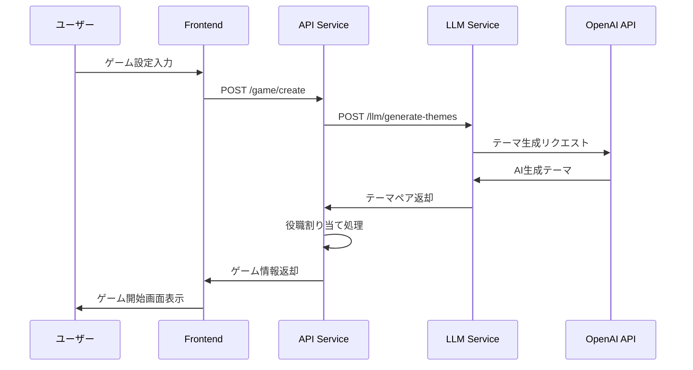
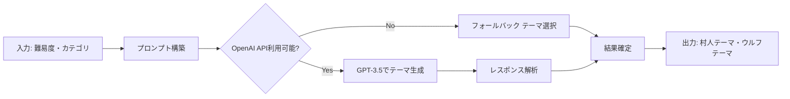
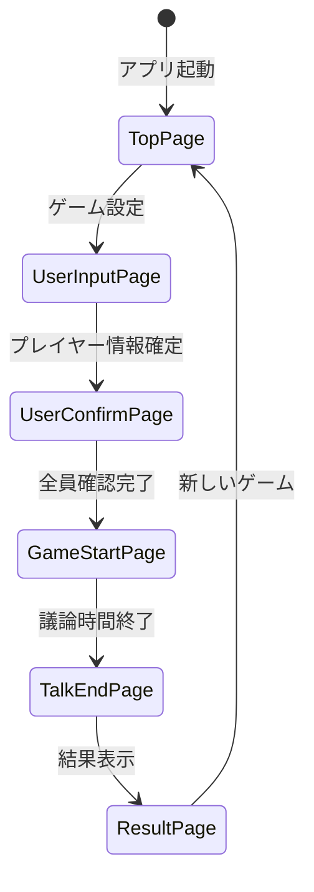

### 📦 コンポーネント詳細

#### 🎨 Frontend
- **責務**: ユーザーインターフェース、ゲーム進行管理
- **技術**: React + TypeScript + Material-UI
- **特徴**: SPA（Single Page Application）、レスポンシブデザイン

#### 🔧 API Service  
- **責務**: ゲーム作成、プレイヤー管理、役職割り当て
- **エンドポイント**: 
  - `POST /game/create` - ゲーム作成
  - `GET /health` - ヘルスチェック

#### 🤖 LLM Service
- **責務**: AIによるテーマ生成、LLMワークフロー管理
- **技術**: OpenAI API + LangGraph
- **エンドポイント**:
  - `POST /llm/generate-themes` - テーマ生成
  - `GET /llm/health` - サービス状態確認

#### 📚 Shared Module
- **責務**: 共通データモデル、定数、型定義
- **内容**: Pydanticモデル、Enum定義

## 🔄 処理フロー

### 1. ゲーム作成フロー


### 2. テーマ生成ワークフロー（LangGraph）


### 3. アプリケーション画面遷移


## 🚀 セットアップ

### 前提条件
- Docker & Docker Compose がインストール済み
- OpenAI APIキー（任意、なくてもフォールバックモードで動作）

### 🔧 環境構築手順

#### 1. リポジトリクローン
```bash
git clone <repository-url>
cd word_wolf
```

#### 2. 環境変数設定
```bash
# .envファイルを作成
cp .env.example .env

# .envファイルを編集（OpenAI APIキーを設定）
echo "OPENAI_API_KEY=your_openai_api_key_here" > .env
```

> **注意**: OpenAI APIキーがない場合でも、フォールバックモードで動作します

#### 3. Docker環境起動
```bash
# 本番環境
docker-compose up -d

# 開発環境（デバッグ機能付き）
docker-compose -f docker-compose.debug.yml up -d
```

#### 4. 動作確認
```bash
# 各サービスの状態確認
curl http://localhost:5173  # Frontend
curl http://localhost:8000/health  # API Service
curl http://localhost:8100/health  # LLM Service
```

### 📱 アクセスURL

| サービス | URL | 説明 |
|---------|-----|------|
| **メインアプリ** | http://localhost:5173 | ゲーム画面 |
| **API仕様書** | http://localhost:8000/docs | FastAPI Swagger UI |
| **LLM仕様書** | http://localhost:8100/docs | LLM API仕様 |

## 🎮 使用方法

### 1. ゲーム設定
1. プレイヤー人数（3〜10人）を選択
2. ウルフ人数を設定
3. 難易度を選択：
   - **Easy**: 明確な違いがある日常的なテーマ
   - **Normal**: 適度な類似性があるテーマ  
   - **Hard**: 細かい違いで議論が必要なテーマ
4. カテゴリ指定（任意）

### 2. プレイヤー登録
各プレイヤーの名前を入力

### 3. お題確認
各プレイヤーが順番に自分のお題を確認

### 4. ゲーム進行
- 制限時間内で自由議論
- 各プレイヤーが自分のお題について話す
- ウルフを推理

### 5. 結果確認
ウルフの正体と正解お題を表示

## 📋 API仕様

### Game API (Port: 8000)

#### ゲーム作成
```http
POST /game/create
Content-Type: application/json

{
  "players": ["Player1", "Player2", "Player3"],
  "wolf_count": 1,
  "difficulty": "normal",
  "category": "食べ物"
}
```

**レスポンス:**
```json
{
  "village_theme": "ラーメン",
  "wolf_theme": "うどん", 
  "players": {
    "Player1": {
      "theme": "ラーメン",
      "is_wolf": false,
      "role": "villager"
    },
    "Player2": {
      "theme": "ラーメン", 
      "is_wolf": false,
      "role": "villager"
    },
    "Player3": {
      "theme": "うどん",
      "is_wolf": true,
      "role": "wolf"
    }
  },
  "total_players": 3,
  "wolf_count": 1
}
```

### LLM API (Port: 8100)

#### テーマ生成
```http
POST /llm/generate-themes  
Content-Type: application/json

{
  "difficulty": "normal",
  "category": "スポーツ"
}
```

**レスポンス:**
```json
{
  "village_theme": "サッカー",
  "wolf_theme": "野球"
}
```

## 🛠️ 開発

### 開発環境起動
```bash
# デバッグモードで起動
docker-compose -f docker-compose.debug.yml up -d

# ログ確認
docker-compose logs -f frontend
docker-compose logs -f api  
docker-compose logs -f llm
```

### 🔧 デバッグ設定

| サービス | デバッグポート | 設定 |
|---------|-------------|------|
| Frontend | 9229 | Node.js Inspector |
| API | 5678 | Python debugpy |
| LLM | 5679 | Python debugpy |

### 📝 開発用コマンド

```bash
# フロントエンド
cd front_end
npm run dev          # 開発サーバー起動
npm run build        # ビルド
npm run lint         # リント実行
npm run generate-api # API型定義生成

# バックエンド（コンテナ内で実行）
docker exec -it fastapi-app bash
python -m pytest    # テスト実行

docker exec -it llm-service bash  
python -m pytest    # LLMサービステスト
```

### 🔄 ホットリロード

開発環境では以下の機能が有効です：
- **Frontend**: Viteによるホットリロード
- **API**: Uvicornによる自動リロード
- **LLM**: Uvicornによる自動リロード

## 🐛 トラブルシューティング

### よくある問題と解決方法

#### 1. OpenAI APIエラー
```bash
# エラー: OpenAI API key not found
# 解決策: .envファイルでAPIキーを設定
echo "OPENAI_API_KEY=your_key" >> .env
docker-compose restart llm
```

#### 2. ポートコンフリクト
```bash
# エラー: Port already in use
# 解決策: 使用中のポートを確認して停止
lsof -i :5173  # フロントエンド
lsof -i :8000  # API
lsof -i :8100  # LLM
```

#### 3. コンテナ起動失敗
```bash
# ログ確認
docker-compose logs [service-name]

# コンテナ再構築
docker-compose down
docker-compose build --no-cache
docker-compose up -d
```

#### 4. フロントエンドAPIエラー
```bash
# API接続確認
curl http://localhost:8000/health

# CORS設定確認（開発時）
# docker-compose.debug.ymlでCORS設定を確認
```

### 🔍 ログ確認

```bash
# 全サービスのログ
docker-compose logs -f

# 特定サービスのログ  
docker-compose logs -f frontend
docker-compose logs -f api
docker-compose logs -f llm

# エラーログのみ
docker-compose logs --tail=100 | grep ERROR
```

### 📊 動作確認

```bash
# ヘルスチェック
curl http://localhost:8000/health
curl http://localhost:8100/health

# API疎通確認
curl -X POST http://localhost:8100/llm/generate-themes \
  -H "Content-Type: application/json" \
  -d '{"difficulty": "easy", "category": null}'
```

## 📄 ライセンス

MIT License

## 🤝 コントリビューション

プルリクエストやイシューの報告を歓迎します！

### 開発の流れ
1. フォークしてブランチを作成
2. 変更を実装
3. テストを実行
4. プルリクエストを作成

---

**Happy Gaming! 🎮**